# muse-platform — High-Level Design Document

> 面試準備用技術文件：系統架構、模組相依性、Feature 時序圖
> 用於展示 backend + AI pipeline + DevOps 的技術深度

---

## 1. System Overview

muse-platform 是一個 Personal Internal Developer Platform (IDP)，包含 4 層 Clean Architecture、41 個模組、24/7 運行的 AI 資料平台。

**核心能力：**
- 4-source 資料收集 pipeline（AI News RSS / YouTube API / 小紅書 Playwright / Twitter API）
- Multi-model LLM routing with A/B test（Claude / DeepSeek / Gemini / Groq）
- Telegram AI Agent（智能問答 + 主動通知 + 指令操作）
- MCP Knowledge Server（FTS5 跨 DB 全文搜尋）
- FastAPI Ops Server + Next.js 控制面板

**Tech Stack：**
- Language: Python 3.12 (UV package manager)
- Framework: FastAPI (async), python-telegram-bot
- Database: SQLite + FTS5 (per-feature 獨立 DB)
- LLM: Anthropic Messages API, DeepSeek API, Gemini API
- Browser Automation: Playwright (CDP)
- Media Processing: Whisper (ASR), Gemini Vision (OCR)
- CI/CD: GitHub Actions, ruff lint, deptry dependency check
- Deployment: launchd daemon (macOS), dual env (dev 7421 / prod 7420)

---

## 2. Overall Architecture (4-Layer Clean Architecture)

```mermaid
graph TB
  subgraph interfaces["INTERFACES LAYER"]
    ops_server["Ops Server\n(FastAPI :7420)"]
    ops_ui["Ops UI\n(Next.js)"]
    telegram["Telegram Bridge"]
    relay["Relay (TG Bot #2)"]
    mcp["MCP Knowledge\n(FTS5 Search)"]
    cli["CLI (Click)"]
    viewer["Content Viewer"]
  end

  subgraph features["FEATURES LAYER — 25+ modules"]
    ai_news["AI News\nCollector"]
    red["Red / XHS\nCollector"]
    youtube["YouTube\nCollector"]
    twitter["Twitter\nCollector"]
    pm["PM Agent\n(GitHub)"]
    creation["Creation\nPipeline"]
    morning["Morning\nRoutine"]
    memory["Memory\nOptimizer"]
  end

  subgraph platform["PLATFORM LAYER — 7 boundary modules"]
    core["muse_core\nConfig · Log · Error"]
    llm["muse_llm\nMulti-Model Router"]
    collectors_p["muse_collectors\nBaseCollector · Enrichment"]
    notify["muse_notify\nTelegram · Audit"]
    http["muse_http_clients\nRetry · VCR"]
    catalog["muse_catalog\nManifest · Auto-Mount"]
    tagger["muse_selector_tagger"]
  end

  subgraph infra["INFRA LAYER — 9 modules"]
    paths["muse_paths\nEnv Resolver"]
    secrets["muse_secrets\nKeychain"]
    scheduler["muse_scheduler\nCron Jobs"]
    logging_m["muse_logging\nJSONL"]
    permissions["muse_permissions"]
    github_m["muse_github"]
    backup["muse_backup"]
    observatory["muse_observatory"]
    deploy["muse_deploy"]
  end

  interfaces -.->|"imports"| features
  features -.->|"imports"| platform
  platform -.->|"imports"| infra

  style interfaces fill:#1B2D4F,stroke:#D4AD2B,color:#E0DAD0
  style features fill:#162340,stroke:#D4AD2B,color:#E0DAD0
  style platform fill:#1B2D4F,stroke:#D4AD2B,color:#E0DAD0
  style infra fill:#162340,stroke:#D4AD2B,color:#E0DAD0
```

**依賴規則（CI 強制）：**
- `interfaces → features → platform → infra`（只能往下）
- ⛔ `platform` 不能 import `features`
- ⛔ `infra` 不能 import 上層
- ⛔ `features` 之間禁止直接 import
- 執行方式：`deptry` + `muse catalog validate`

---

## 3. Module Dependency Graph

### 3.1 Infra Layer Dependencies

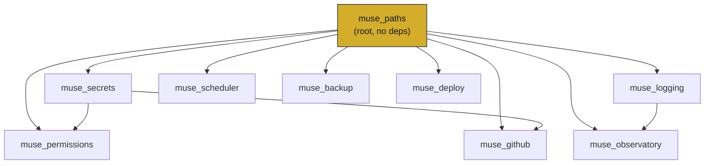

### 3.2 Platform Layer Dependencies

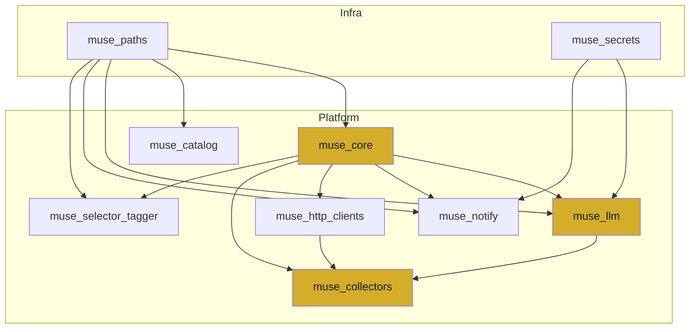

### 3.3 Feature → Platform/Infra Dependencies（4 大 Collector + PM Agent）

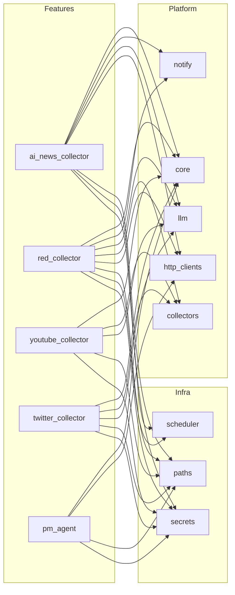

### 3.4 Interface → Platform/Infra Dependencies

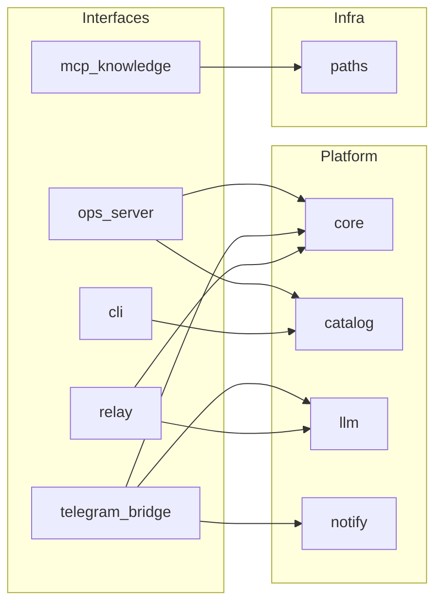

---

## 4. Feature Sequence Diagrams

### 4.1 Collector Pipeline（通用流程）

```mermaid
sequenceDiagram
  participant S as Scheduler (cron)
  participant C as Collector (Feature)
  participant Src as External Source
  participant DB as SQLite DB
  participant LLM as muse_llm (Platform)
  participant N as muse_notify (Platform)

  S->>C: trigger job

  Note over C: allocate correlation_id

  rect rgb(30, 45, 80)
    Note over C,Src: Phase 1 — Collect
    C->>Src: fetch raw data (paginated)
    Src-->>C: raw items
  end

  rect rgb(30, 45, 80)
    Note over C: Phase 2 — Normalize
    C->>C: deduplicate (SHA256 content_hash)
    C->>C: parse JSON fields
  end

  rect rgb(30, 45, 80)
    Note over C,DB: Phase 3 — Store
    C->>DB: INSERT / UPDATE posts
  end

  rect rgb(30, 45, 80)
    Note over C,DB: Phase 4 — Score (5 dimensions)
    C->>C: compute ai_value / muse_value / career / project / social
    C->>DB: UPDATE post_metadata
  end

  rect rgb(40, 55, 90)
    Note over C,LLM: Phase 5 — Classify (LLM)
    C->>LLM: call(prompt, task="classify_*")
    LLM-->>C: category, impact, time_sensitivity
    C->>DB: UPDATE post_metadata
  end

  rect rgb(40, 55, 90)
    Note over C,LLM: Phase 6 — Enrich (LLM)
    C->>LLM: call(prompt, task="enrich_*")
    LLM-->>C: llm_summary, personal_insights
    C->>DB: INSERT post_enrichment
  end

  rect rgb(50, 65, 100)
    Note over C,LLM: Phase 7 — Expert Review (parallel LLM)
    par TECH_LANDSCAPE (score > 0.7)
      C->>LLM: call(task="expert_*")
    and SYSTEM_INTEGRATION (score > 0.5)
      C->>LLM: call(task="expert_*")
    and CAREER_GROWTH (score > 0.3)
      C->>LLM: call(task="expert_*")
    and CREDIBILITY_CHECK (all)
      C->>LLM: call(task="expert_*")
    end
    LLM-->>C: expert_review (JSON)
    C->>DB: UPDATE post_enrichment
  end

  rect rgb(30, 45, 80)
    Note over C,N: Phase 8 — Notify
    C->>N: send_telegram(digest)
  end

  Note over C: write pipeline log (JSONL)<br/>update _latest.jsonl symlink
```

### 4.2 LLM Task-Based Routing

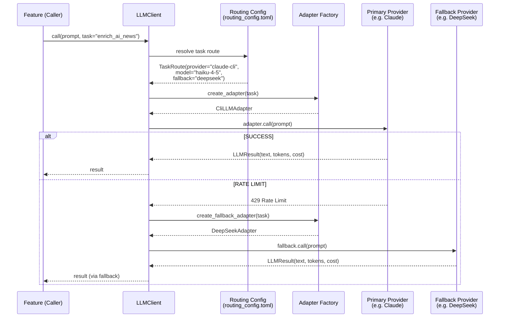

**Routing Config 範例 (routing_config.toml):**

```toml
[defaults]
provider = "anthropic"
model = "claude-sonnet-4-6"
max_tokens = 4096
temperature = 1.0

[tasks.classify_ai_news]
provider = "claude-cli"
model = "claude-sonnet-4-6"
max_tokens = 1024
fallback_provider = "deepseek"
fallback_model = "deepseek-chat"

[tasks.enrich_ai_news]
provider = "claude-cli"
model = "claude-haiku-4-5"
max_tokens = 4096
fallback_provider = "deepseek"
fallback_model = "deepseek-chat"

[tasks.expert_ai_news]
provider = "claude-cli"
model = "claude-opus-4-6"
max_tokens = 8192
fallback_provider = "deepseek"
fallback_model = "deepseek-reasoner"
```

### 4.3 MCP Knowledge Server — Cross-DB FTS5 Search

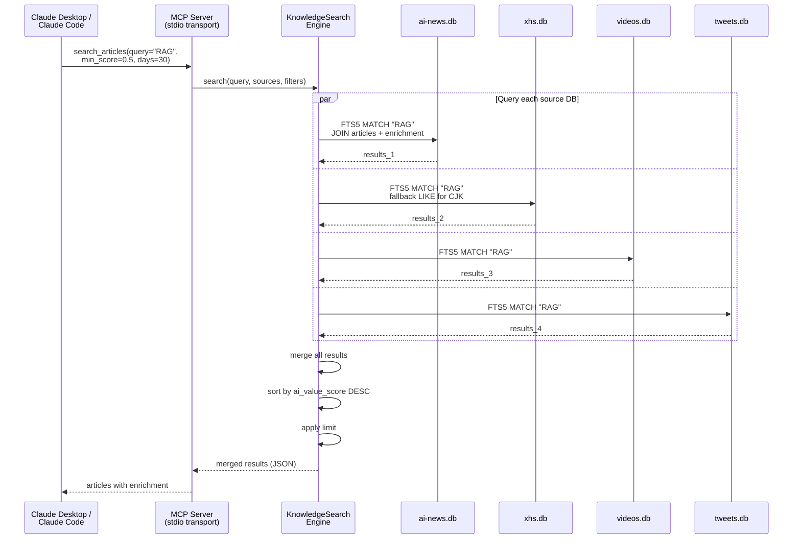

### 4.4 Telegram AI Agent — 對話流程

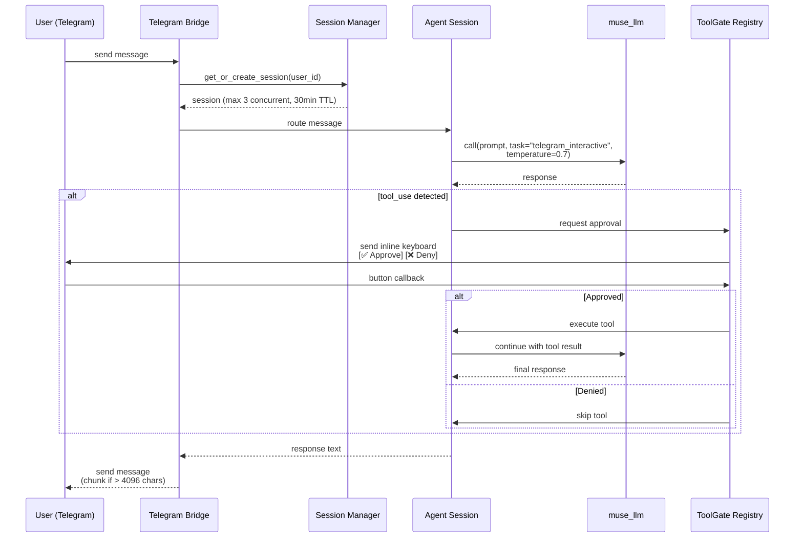

### 4.5 Ops Server — Catalog-Driven Auto-Mount

```mermaid
sequenceDiagram
  participant UI as Ops UI (Next.js)
  participant OS as Ops Server (FastAPI)
  participant Cat as muse_catalog
  participant FM as Feature Modules

  rect rgb(30, 45, 80)
    Note over OS,FM: Startup Phase
    OS->>Cat: load_catalog()
    Cat->>Cat: scan all muse.toml files
    Cat-->>OS: ModuleManifest[]

    loop for each module with [router]
      OS->>FM: importlib.import_module(router_path)
      FM-->>OS: FastAPI Router
      OS->>OS: app.mount(mount_path, router)
    end

    loop for each module with [ops_ui]
      OS->>OS: register actions + card definitions
    end
  end

  rect rgb(40, 55, 90)
    Note over UI,FM: Runtime Phase
    UI->>OS: GET /api/features
    OS-->>UI: feature cards (title, actions, status)

    UI->>OS: POST /api/actions/{feature}/{action}
    OS->>FM: importlib → import handler
    OS->>FM: handler()
    FM-->>OS: result
    OS-->>UI: execution response
  end
```

### 4.6 A/B Test Pipeline（LLM Cost Optimization）

```mermaid
sequenceDiagram
  participant Op as Operator (Reed)
  participant AB as AB Test Script
  participant DB as Experiment DB
  participant PA as Provider A (Claude)
  participant PB as Provider B (DeepSeek)
  participant Judge as LLM Judge (Opus)

  rect rgb(30, 45, 80)
    Note over Op,PB: Phase 1 — Run Experiment
    Op->>AB: run --group baseline --limit 60
    AB->>DB: load 60 articles from SQLite

    loop for each article
      AB->>PA: classify (Claude Sonnet)
      PA-->>AB: result_A + cost_A
      AB->>PB: classify (DeepSeek Chat)
      PB-->>AB: result_B + cost_B
      AB->>DB: store results + costs
    end
  end

  rect rgb(40, 55, 90)
    Note over Op,Judge: Phase 2 — Judge Quality
    Op->>AB: judge --node enrich
    loop for each result pair
      AB->>Judge: compare quality (Claude Opus)
      Judge-->>AB: quality scores
      AB->>DB: store judgments
    end
  end

  rect rgb(50, 65, 100)
    Note over Op,AB: Phase 3 — Summary & Apply
    Op->>AB: summary
    AB->>DB: aggregate latency, cost, quality per group
    AB-->>Op: report: "DeepSeek 83% cheaper,<br/>same quality for classify"

    Op->>Op: UPDATE routing_config.toml<br/>task → provider mapping
  end
```

---

## 5. Database Architecture

### 5.1 Per-Feature Isolated SQLite DBs

```
$MUSE_DATA_DIR/
├── ai_news_collector/
│   └── ai-news.db          ← articles, article_enrichment
├── red_collector/
│   └── xhs.db              ← posts, post_enrichment, post_metadata (Schema V12)
├── youtube_collector/
│   └── videos.db           ← videos (with transcript, enrichment)
├── twitter_collector/
│   └── tweets.db           ← tweets, tweet_enrichment
├── scheduler/
│   └── scheduler.db        ← job queue, execution history
├── config/
│   └── llm/
│       └── routing_config.toml  ← LLM routing overrides
├── logs/
│   └── pipelines/
│       ├── ai_news_collector/
│       │   ├── 2026-05-16T02-00-00Z-{corr_id}.jsonl
│       │   └── _latest.jsonl → (symlink)
│       └── red_collector/
│           └── ...
└── audit/
    └── commands.jsonl       ← all Telegram commands audited
```

### 5.2 Red Collector Schema (xhs.db) — ER Diagram

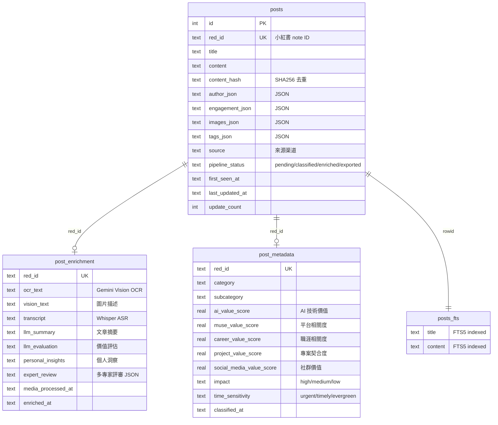

### 5.3 Cross-DB Query Strategy (MCP Knowledge Server)

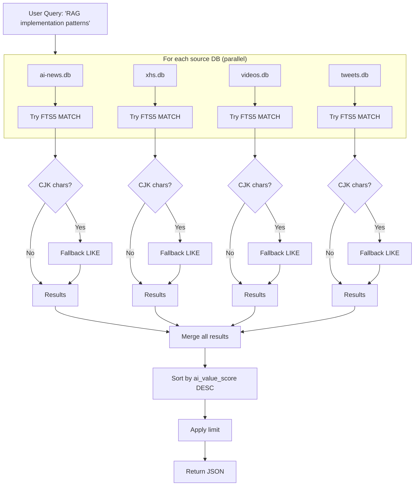

---

## 6. Deployment Architecture

```mermaid
graph TB
    subgraph Host["macOS Host"]
        subgraph Services["launchd Daemons"]
            tg_svc["ai.muse.telegram-bridge"]
            relay_svc["ai.muse.relay"]
            sched_svc["ai.muse.scheduler"]
        end

        subgraph Servers["Application Servers"]
            ops_prod["Ops Server :7420 (prod)"]
            ops_dev["Ops Server :7421 (dev)"]
            ui_prod["Ops UI :3000 (prod)"]
            ui_dev["Ops UI :3001 (dev)"]
        end

        subgraph Env["Environment Variables"]
            env1["MUSE_ENV = prod | dev"]
            env2["MUSE_HOME = ~/Projects/muse-platform"]
            env3["MUSE_DATA_DIR = ~/.muse-brain"]
            env4["MUSE_PORT = 7420 | 7421"]
        end

        subgraph Secrets["Secrets Management (3-Layer)"]
            s1["Layer 1: macOS Keychain"]
            s2["Layer 2: .env.$MUSE_ENV"]
            s3["Layer 3: ~/.zshrc"]
        end
    end

    subgraph CI["GitHub Actions CI"]
        pr["PR Trigger"]
        pr --> lint["ruff lint"]
        pr --> deptry["deptry (DAG check)"]
        pr --> test["pytest unit + P0"]
        pr --> review["Gemini Code Review"]

        tag["Tag v* Trigger"]
        tag --> full["Full integration test"]
        full --> deploy["Deploy prod"]
    end

    Services --> Servers
    Env --> Servers
    Secrets --> Services
```

---

## 7. Key Architectural Patterns

### 7.1 Boundary Module Hardening
- 位於依賴 DAG 底層、被 ≥2 個上游依賴的模組
- 規則：fail loud（三段式錯誤訊息）、package data 用 `importlib.resources`、env var 包 domain error
- 清單：`muse_paths`, `muse_secrets`, `muse_core`, `muse_llm`, `muse_catalog`, `muse_collectors`, `muse_notify`, `muse_observatory`

### 7.2 Pipeline Log Atomicity
- Events 在記憶體中緩衝，結束時一次性寫入 JSONL
- 第一行永遠是 `run_summary`（便於快速 peek）
- `_latest.jsonl` symlink 供 Ops UI 低成本輪詢
- 保證 crash 時不產生半寫入的 log 檔

### 7.3 Correlation ID Propagation

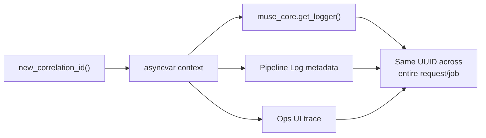

### 7.4 Catalog-Driven Discovery

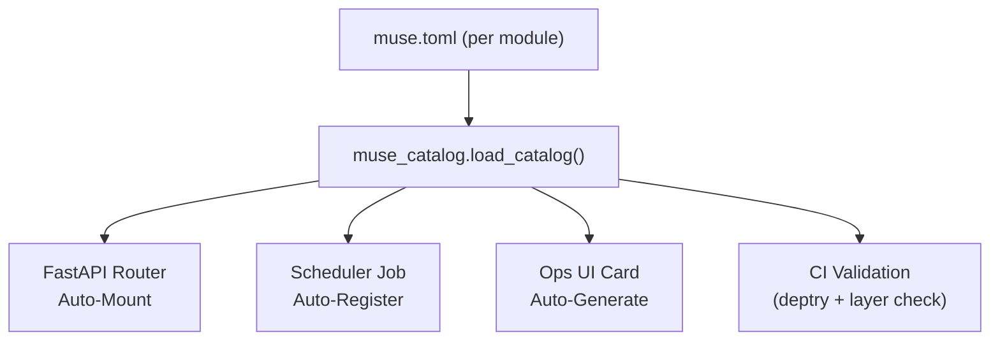

### 7.5 VCR.py Test Isolation
- 外部 API 呼叫（LLM、Telegram、RSS）用 VCR.py 錄製 cassette
- CI 中 replay cassette，不打真實 API
- 確保 test 可重現且不產生費用

---

## 8. Cost Optimization 成果

| 策略 | 做法 | 效果 |
|------|------|------|
| Task-Based Model Routing | classify → Sonnet, enrich → Haiku, expert → Opus | 避免所有任務都用最貴的模型 |
| A/B Test Provider 比較 | Claude vs DeepSeek vs Groq vs Gemini | 找到同品質但更便宜的 provider |
| Fallback on Rate Limit | Claude rate limit → auto fallback DeepSeek | 不浪費等待時間 |
| 結果 | task-based routing + provider 切換 | **LLM 成本降低 83%** |
